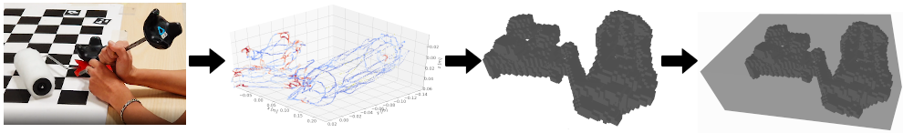

# Data Acquistion

Data calibration and extraction codes and documentation will be added until 25.8.
We provide docker installation and instructions for acquiring the bounding box for a new tool.

## 1) Data collection

### Camera calibration

## 2) Object tracing

To be able to provide the reference bounding boxes for the new tool, we first have to find the bounding boxes of the manipulated objects relative to the tracker.

We provide a docker installation for the method, sample data and ipython notebook where individual steps are demonstrated. For details see the [Trace extractor README.md](./trace-extractor/README.md)

## 3) Data extraction

### 3a) Extracting images from the bag files

### 3b) Processing the extracted images

https://user-images.githubusercontent.com/17249817/185711525-d843e1ba-f15c-4c0c-bc9c-3b83eaa505a7.mp4
