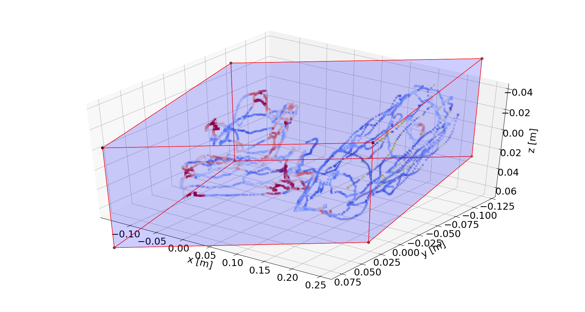
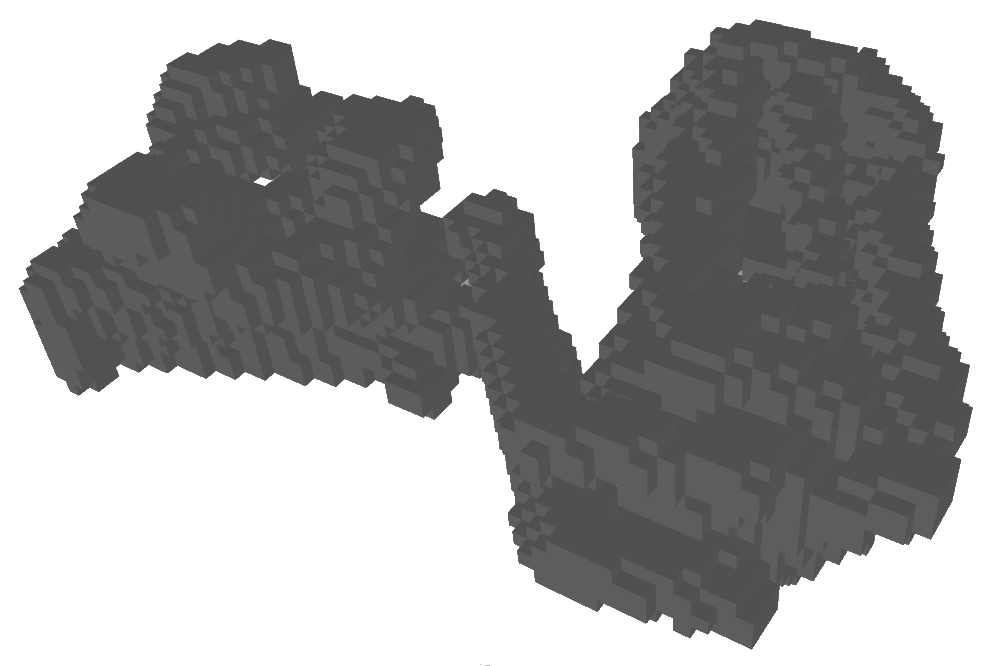
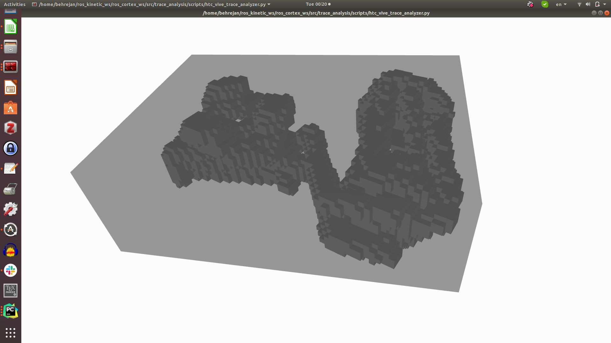
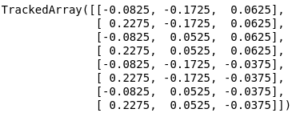

# Trace extractor

## Method description
To be able to provide the reference bounding boxes for the new tool, we first have to find the bounding boxes of the manipulated objects relative to the tracker. The process consists of the following steps:

1) The data are collected from the surface of the object. The tool and attached tracker surfaces are traced with a tracked pointing device while recording the positions of both trackers and saving them into a bag file (see Fig. below). The traced object can be manipulated (avoid quick motions) while being traced to enable acquisition of data from all sides. For a valid bounding box it is important to trace the object with a regular reasonably dense pattern. We use button presses to indicate when the tracing tool is touching the surface of the object.


2) The acquired surface points are filtered (points that are likely not part of the surface are removed).



3) Voxel grid with the dimensions of the object is created.



4) A minimal bounding box aligned with the tracker's $z$-axis is calculated using the trimesh library \cite{trimesh} while evaluating volumes for different rotations.



5) A list of corner points relative to tracker is created.



-

The details of the whole procedure and its accuracy are described in the accompanying paper and its supplementary material (Appendix~A.2).

## Installation and example using sample data
Here we provide a docker installation for the method, sample data and ipython notebook where individual steps are demonstrated.

Make sure you have Docker installed and are in a `docker` group. [Docker Installation Details](https://wiki.archlinux.org/title/docker#Installation)

### Quickstart - Demo

```bash
git clone git@gitlab.ciirc.cvut.cz:hajekric/trace-extractor.git --recursive
cd trace-extractor
./run.sh
```

Access the Jupyter server by by opening the provided link in the browser. Then open the notebook `src/trace_extractor.ipynb`.

Run each cell in the given order to load and analyze the trace data.


## Quickstart - Your own

```bash
git clone git@gitlab.ciirc.cvut.cz:hajekric/trace-extractor.git
cd trace-extractor
# Place your data in data folder, create it if it doesn't exit
./run.sh # You will have to change paths in the notebook
```

